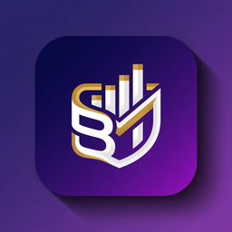
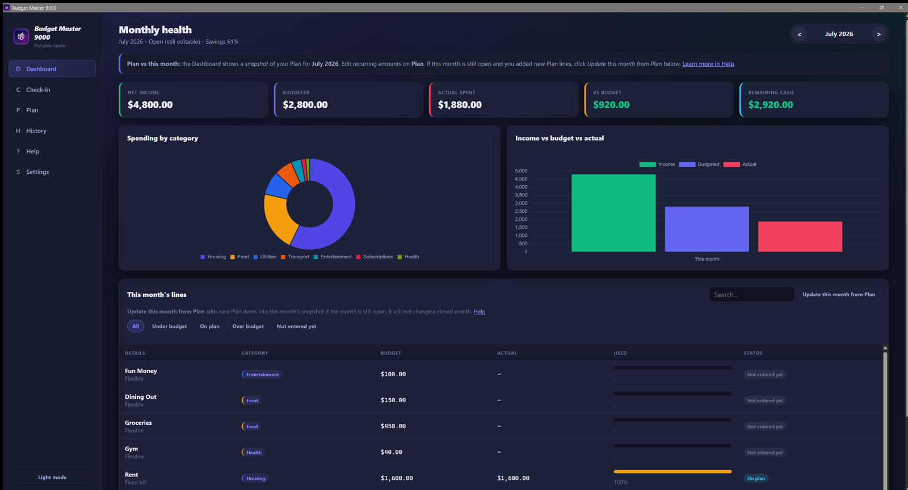
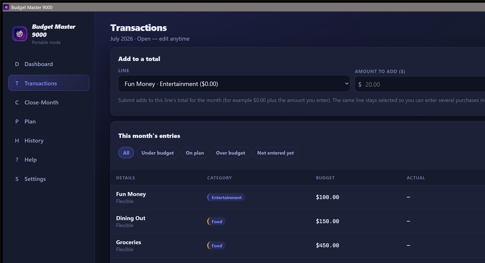
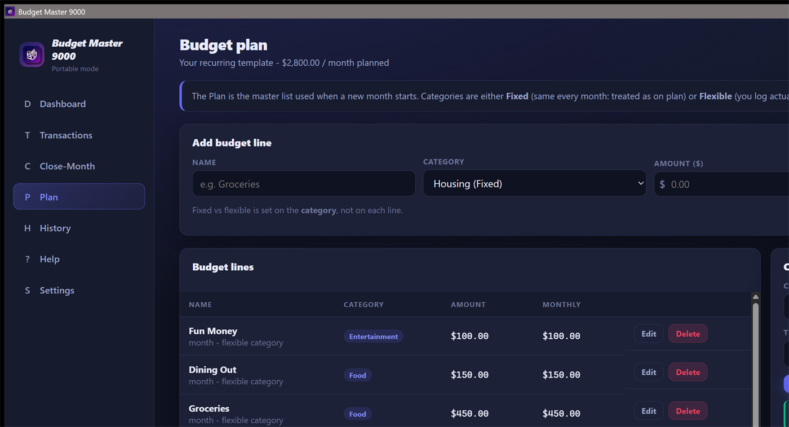
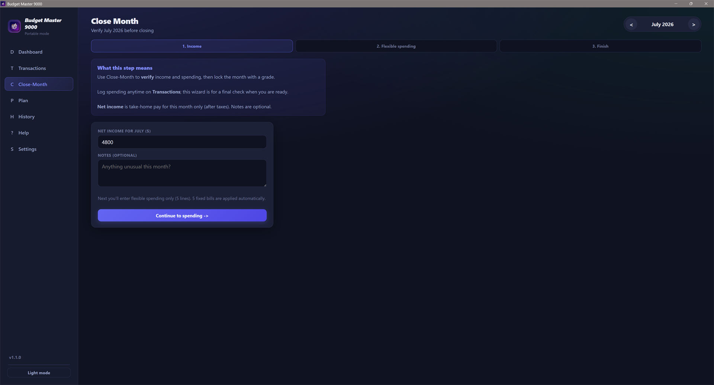
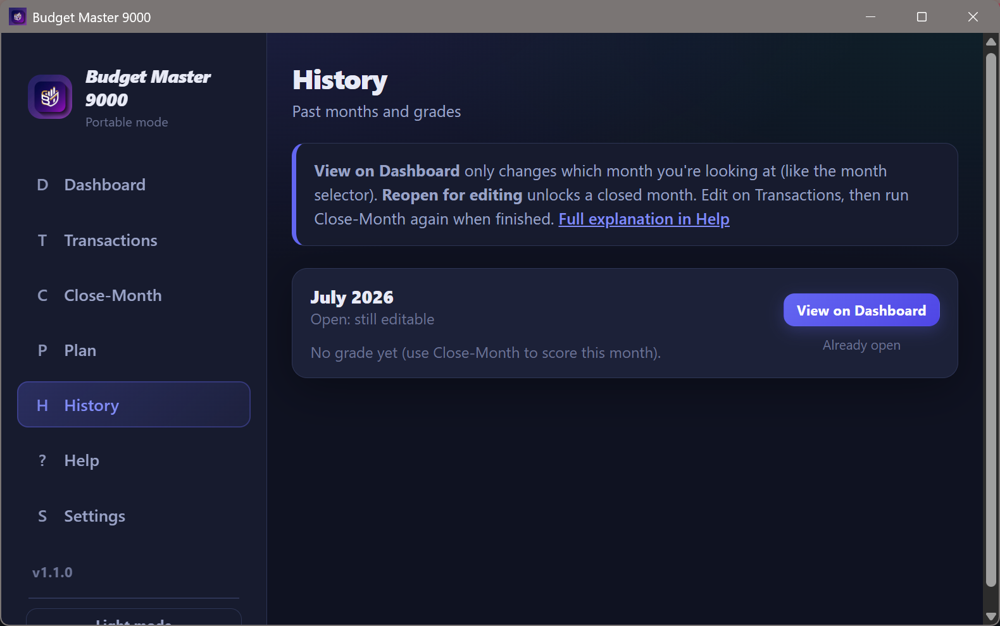
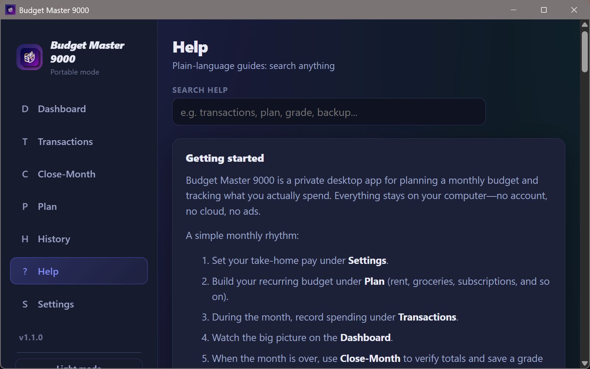
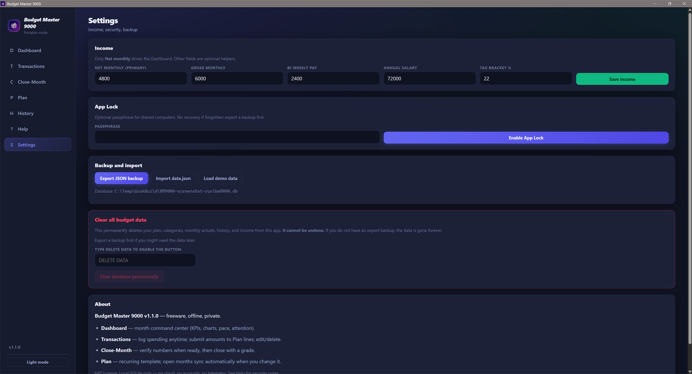

  

<h1 align="center">Budget Master 9000</h1>

  <strong>Your monthly budget, finally clear.</strong> 
  See what you planned, what you actually spent, and the real trends — in a simple Windows app you’ll actually use.

  
  
  

---

## Why this exists

Most budgeting tools are either too complicated or too disconnected from real life.  
You end up with plans that don’t match reality, or you stop using the tool altogether.

**Budget Master 9000** was built to answer three simple questions every month:

- What did I plan to spend?
- What did I actually spend?
- Where should I adjust next month?

It focuses on clarity and real trends so you can see the picture quickly and keep using it.

*See the whole month at a glance: income, budget, actual spending, charts, pace, and what needs attention.*

---

## Get started

1. **[Download the latest version](https://github.com/codemonkey2k5/BudgetMaster9000/releases/latest)** for Windows.
2. Choose **one** option:

| What you download | New install | Upgrade |
|-------------------|-------------|---------|
| **Installer** (setup `.exe`) | Run it, then open Budget Master 9000 from the Start menu or desktop. | Run the new setup. Your budget is kept automatically. The desktop shortcut is put back for you. |
| **Portable** (`BudgetMaster9000.exe`) | Save it anywhere and double-click it. | Put the new file in the **same folder** as the old one (replace it). Do not move your data file (`bm9000.db`). |
| **Windows zip** | Open the zip, then use the installer or the portable file inside. | Same as above. The zip includes short upgrade notes. |

No other software is required. No accounts to create.

On first open you can start blank, load a demo budget, or import a backup.

> **Windows 10 or 11, 64-bit.**

---

## What you can do

| Feature | What it helps you see |
|---------|-----------------------|
| **Dashboard** | Income, budget, actual spending, charts, spending pace, and items that need attention — the whole month in one place. |
| **Transactions** | Log spending anytime with a date. Sort the table by any column. |
| **Plan** | Set up your recurring budget (rent, groceries, subscriptions, etc.). Changes stay in sync with the current month. |
| **Close-Month** | Review the month, see the results, and give it a grade so you have a clear record of how it went. |
| **History** | Look back at previous months and reopen one if you need to make a correction. |
| **Reports** | Detailed lists and summaries (by category, day, fixed vs flexible, over-budget items, month-to-month comparison). Print any report. |
| **Help** | Searchable answers written in plain language. |
| **Settings** | Set your take-home pay, optional app lock, and export/import backups. |

Your version number is in the lower left. When a newer version is available, an update notice appears so you can download it when you’re ready.

---

## Screenshots

### Dashboard

### Transactions

### Plan

### Close-Month

### History

### Help

### Settings

---

## A typical month

1. Set your take-home pay under **Settings**.
2. Build or adjust your **Plan**.
3. During the month, log spending on **Transactions**.
4. Check progress anytime on the **Dashboard**.
5. At the end of the month, use **Close-Month** to review the numbers and save a grade.

That’s it. The goal is to make the process light enough that you’ll keep doing it.

---

## Notes

- Everything is stored on your computer in a local file (`bm9000.db`).
- Optional App Lock is available if you use a shared machine.
- Export a backup before making big changes. Clearing data cannot be undone without a backup.

---

## License

[MIT](LICENSE). Free for personal and commercial use.

---

  <em>Budget Master 9000 — clear monthly trends, simple enough to stick with.</em>

