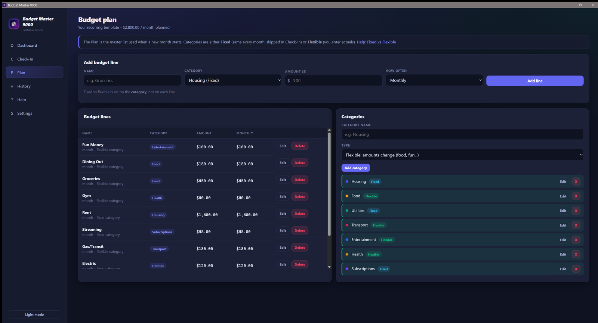
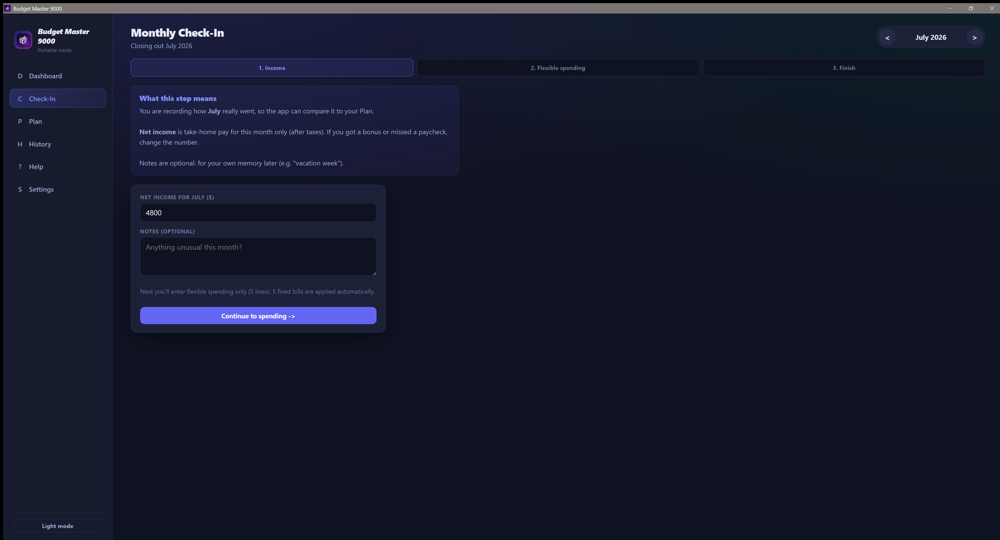
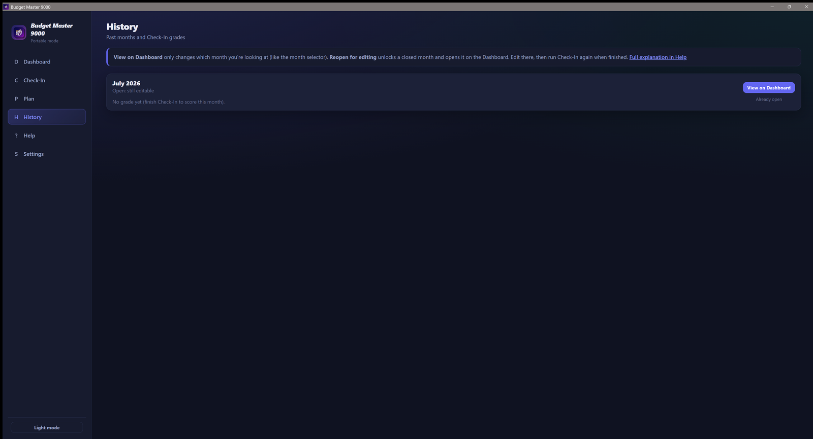
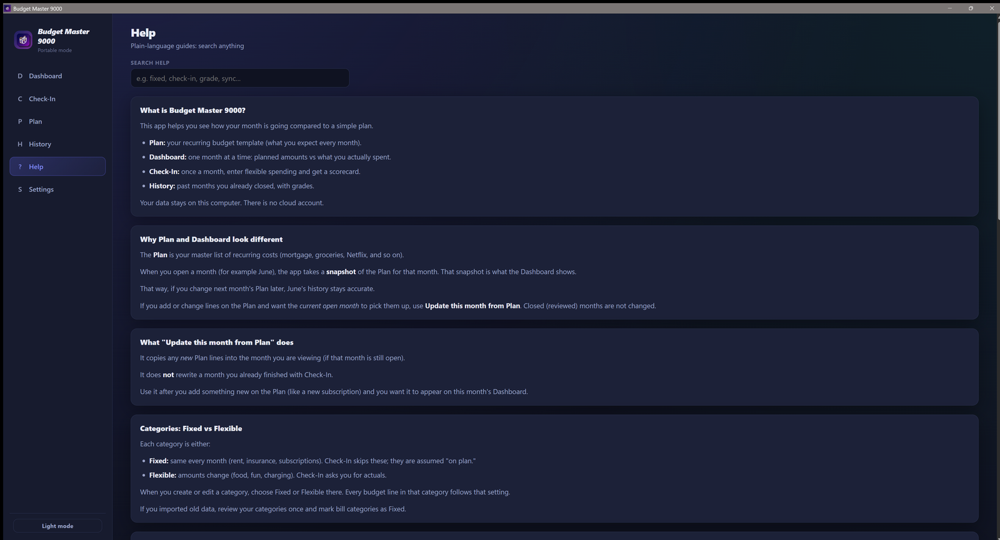
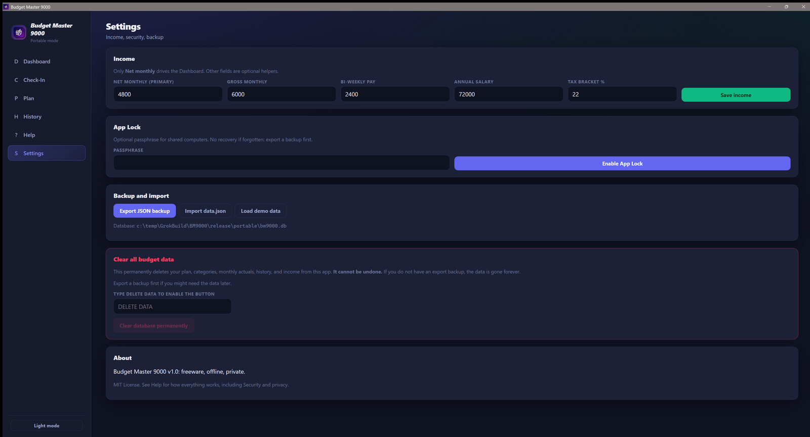

  

<h1 align="center">Budget Master 9000</h1>

  <strong>Your monthly budget, finally clear.</strong> 
  Private. Offline. One Windows app. No accounts. No cloud. No subscription.

  
  
  
  

---

## Why this exists

Most budget tools want your bank login, your email, and a monthly fee.  
**Budget Master 9000** wants none of that.

You get a calm desktop app that answers the only questions that matter:

- What did I *plan* to spend this month?
- What did I *actually* spend?
- Where did I do well, and where should I tighten up?

Built for people who like a simple plan, a monthly ritual, and data that never leaves their PC.

*See this month at a glance: income, budgeted totals, actuals, and high-contrast spending charts.*

---

## Get started

1. Download the latest Windows release from [Releases](../../releases).
2. Choose **one** of these — no extra software to install, no files to copy around:

| Download | What to do |
|----------|------------|
| **Installer** (`.exe` setup or `.msi`) | Run it. Follow the prompts. Open Budget Master 9000 from the Start menu or desktop. |
| **Portable** (single `.exe`) | Save it anywhere (Desktop, USB drive, folder). Double‑click it. |

That’s it. On first launch the app creates your local database for you, then offers **Start blank**, **Load demo**, or **Import** a backup.

There is nothing else to download, no accounts to create, and no setup scripts.

---

## Features

| | |
|---|---|
| **Month-first dashboard** | Switch months, see health cards, progress bars, and category charts. |
| **Plan vs Actual** | Recurring plan is your template. Each month is a snapshot you can still update while open. |
| **Monthly Check-In** | A guided walkthrough for flexible spending only. Fixed bills auto-fill. Finish with a letter grade and plain-English tips. |
| **Fixed vs Flexible categories** | Mark housing and subscriptions Fixed. Mark food and fun Flexible. Check-In only asks about what changes. |
| **History** | Closed months keep their grades. Reopen only when you need to fix something. |
| **Import / export** | Bring in an older backup, or export a full backup anytime. |
| **Optional App Lock** | Passphrase gate for shared computers. |
| **Portable** | One file. Run it. Your database appears next to it automatically. |
| **Built-in Help** | Searchable guides written for humans, not accountants. |

---

## Screenshots

### Dashboard: this month’s story

Net income, budgeted total, actuals, variance, remaining cash, and charts with high-contrast slices so categories stay easy to tell apart.

### Plan: set it once, reuse every month

Add recurring lines (weekly, monthly, or yearly). Categories own Fixed vs Flexible so the whole plan stays consistent.

### Check-In: close the month with a real scorecard

Step-by-step: confirm income, enter flexible spending, review totals, finish. Fixed bills are already treated as on plan.

### History: grades you can understand

Browse past months, jump to any month on the Dashboard, or reopen a closed month when you need to correct numbers (then run Check-In again).

### Help: answers in plain language

Search topics like Fixed vs Flexible, Plan vs Dashboard, grades, import, and security.

### Settings: income, lock, backup, and a safe reset

Net monthly income drives the math. Optional App Lock. Export backups. Clear data only if you type `DELETE DATA`.

---

## How a typical month looks

1. **Plan** once (or import a backup).
2. Live the month.
3. Open **Check-In**, enter flexible actuals, finish.
4. Read the grade and the “needs attention” list.
5. Adjust next month’s Plan if something consistently overruns.

Fixed bills (rent, insurance, streaming) fill themselves on the Dashboard so they do not show as “not entered.”

---

## Privacy, on purpose

- **No accounts**
- **No cloud sync**
- **No ads**
- **No telemetry**

Everything stays on your computer. Optional App Lock is for casual privacy on a shared PC — not a substitute for full-disk encryption (BitLocker) or a good Windows password. Export backups before major changes. Clearing the database is permanent without a backup.

---

## License

[MIT](LICENSE). Free for personal and commercial use.

---

  <em>Budget Master 9000: private by default, useful every month.</em>

